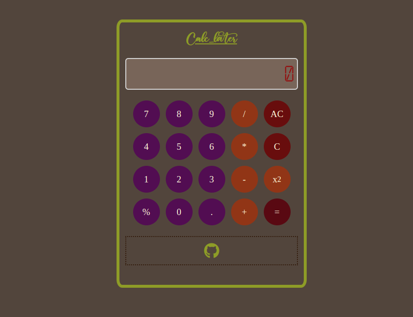

# TABLE OF CONTENTS

1.[Description](##Description) 2.[Purpose](##Purpose) 3.[Upcoming features](##upcoming-features) 4.[Keyboard shortcuts](##keyboard-shortcuts) 5.[Link]()

## Description

This is an on-screen calculator using HTML, CSS and JavaScript.

## Purpose

To showcase understanding of JavaScript fundamentals and DOM manipulation skills.

## Upcoming features 

Here's what to watch out for:

- Popup for viewing keyboard shortcuts on the fly.

## Keyboard shortcuts 

| On-screen symbol | Keyboard Shortcut |
| ---------------- | ----------------- |
| =                | = or Enter        |
| AC               | c                 |
| C                | Backspace         |
| x power 2        | p                 |

The rest of the button's shortcuts correspond to their symbols.

## Link

https://eddy518.github.io/calculator/
